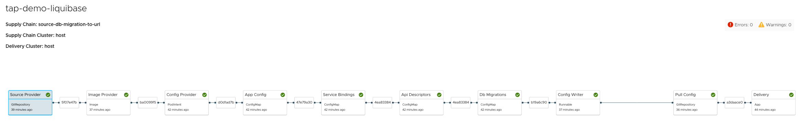

# TAP Demo Liquibase

This repository is used as a playground to experiment with Tanzu Application Platform (TAP) and Liquibase in order
to run database migrations as part of the Path to Production.

## Run the demo

Currently the setup is almost fully automated, the only manual step would be generating and setting up an SSH key pair that will be used in order to configure the GitOps strategy. The key pair would need to be deployed as a kubernetes secret in the cluster as well as uploaded on GitHub.

Run the following script in order setup the cluster and configure the supply chain and workload.

```
./bin/setup.sh
```

## Custom Supply Chain



Typically TAP comes with a basic out-of-the-box (OOTB) supply chain, namely `source-to-url`.

In order to experiment with a custom supply chain[^1], we started from a copy of the  `source-to-url` and applied the following
changes:

* The `config-provider` step, which defines the Knative serving manifest for the workload, has been re-configured to use a new template, namely `enhanced-convention-template`
    * This new `ClusterConfigTemplate` is an enhanced version of the `convention-template`, it prepends an `initContainer` that will run the database migration ar runtime, with the following assumptions:
        * A service binding exists with the name `db`, containing the credentials to access the database with the ability to execute DDLs
        * A config map exists with the name `<workload-name>-liquibase-config`, containing the migration changelog and database migrations to apply
* A new step named `db-migrations-provider`, configured to use a new template `liquibase-config-provider-template`
    * It leverages a tekton `ClusterTask`, namely `liquibase-config-provider-task`, in order to encode the database migrations from the source code into YAML
* A new step name `db-migrations`, configured to use a new template `liquibase-config-template`
    * It receives the config from the `api-descriptors` step and append a new entry containing the `ConfigMap` of all the database migrations received by the `db-migration-provider` step
    * The output of this template is then used by the `config-provider` step in order to generate the GitOps configuration to apply at deploy time.

In order to support data flowing from Tekton to the Supply Chain, we created a reusable `ClusterRunTemplate`, namely `tekton-results-taskrun`, which can be used by any `Runnable` in order to to expose any results coming from a tekton `Task`.

The custom supply chain will be activated if the workload contains the label `apps.tanzu.vmware.com/has-db-migrations: "true"`.

## TODOs

[] Replace the hardcoded bits used to for the db migrations (paths, secret names, etc) to be parameters provided in the workload
[] Suppose the credentials for running the DDLs are separate from the credentials used in the app
[] Generalise to support other schema migrations tools such as Flyway

## Caveats

A single `ConfigmMap` has a size limit of `1MB`, which does include the whole resource definition and is not limited to the data field.
Currently the `ConfigMap` passed through the SupplyChain is already used to carry resource definitions for the Knative serving, service bindings and api descriptors.
That said all that content typically require on average `10KB`, suppose even a 10x increase it will take no longer than `100KB` of space, which gives us around `900KB` to store database migrations.
Even considering `2KB` (beefy) per migrations, it will still give us space for 450 migrations.

Another size limitation is imposed by the Tekton results. By default a single `ClusterTask` (or `Task`) cannot store more than 4KB of data, so we had to patch some feature flags in order to increase that value (See the next section) and even so, there is still an upper limit of `1.5MB` imposed by Kubernetes for any given CRD.

---

We have tested our proof of concept on top of TAP Sandbox, which provides ephemeral Tanzu Application Platform clusters.

It currently provides TAP v1.6.1 but it does also apply some limitations on the cluster, despite being quite customisable.

Please run the `./tap-sandbox-patches.sh` in order to ensure the cluster is ready to be used for this demo.

Specifically we've found the following (fixable) limitations:

* The cluster uses [Kyverno](https://kyverno.io/) for policies management, and there is one policy regarding max memory usable by a Pod.
Unfortunately there is a very small and subtle mistake, it has been set to `2048M` and that causes an error when running the supply chain using the GitOps strategy,
even when using the out-of-the-box supply chain. Specifically kubernetes rejects the pod needed to run the Tekton task for the `config-writer`.
Updating that value to `2Gi` fixes the problem (remmeber that `2Gi` ~ `2147MB` > `2048MB`).
The rule of thumb for setting limits is the following:
    * For setting a `min` value use power of 10 units such as KB, MB, GB, TB, etc (the B, as in bytes, is optional)
    * For setting a `max` value use power of 2 units such as KiB, MiB, GiB, TiB, etc (the B, as in bytes, is optional)
    * Remember that 1KB = $10^3$ bytes = 1000 bytes, 1KiB = $2^{10}$ bytes = 1024 bytes

* The default service account is controlled by the [TAP namespace provisioner](https://docs.vmware.com/en/VMware-Tanzu-Application-Platform/1.6/tap/namespace-provisioner-use-case4.html), which means that in order to associate the gitops secret
to the service account we would need to either:
    * apply an updated version of the tap values used for installation
    * use carefully crafted [annotations](https://docs.vmware.com/en/VMware-Tanzu-Application-Platform/1.6/tap/namespace-provisioner-parameters.html#namespace-parameters) on the namespace (we opted for this one)

* Knative comes with init containers disabled by default, so we had to update a specific config map in order to enable the feature flag.

* Tekton comes with a limitation on the results size of a `Task`, which is around 4KB (in total for a single Task), which is quite a limitation.
But it does support larger results by [enabling a specific feature flag](https://tekton.dev/docs/installation/additional-configs/#enabling-larger-results-using-sidecar-logs), and will also require to change the max size in the same configuration.

[^1]: It seems that TAP GUI is not able to visualise supply chains that are described as a graph as opposed to a linked-list of steps. In our particular case that translates into the "db-migration-provider" step to be completely ignored/hidden in the UI.
